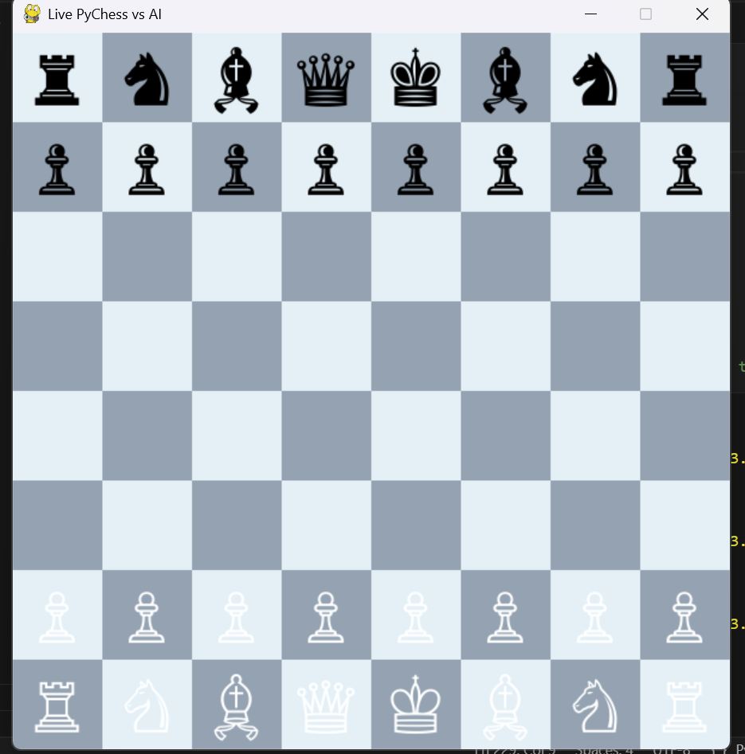
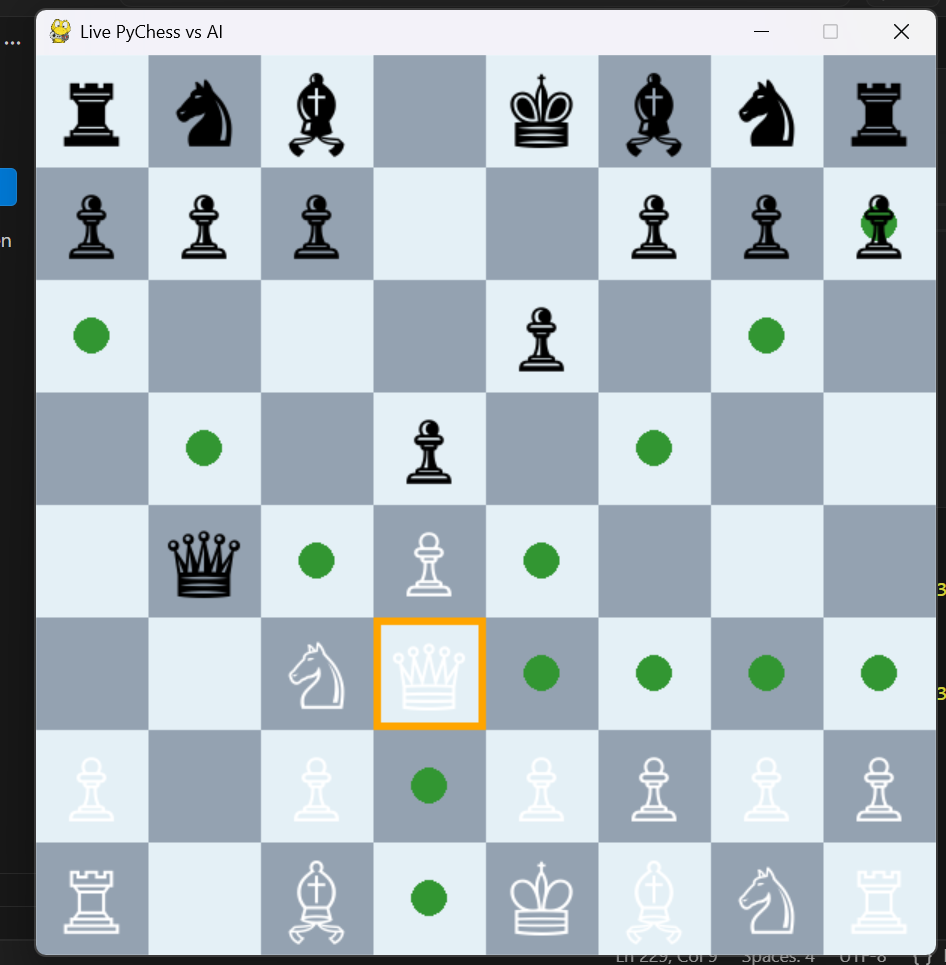
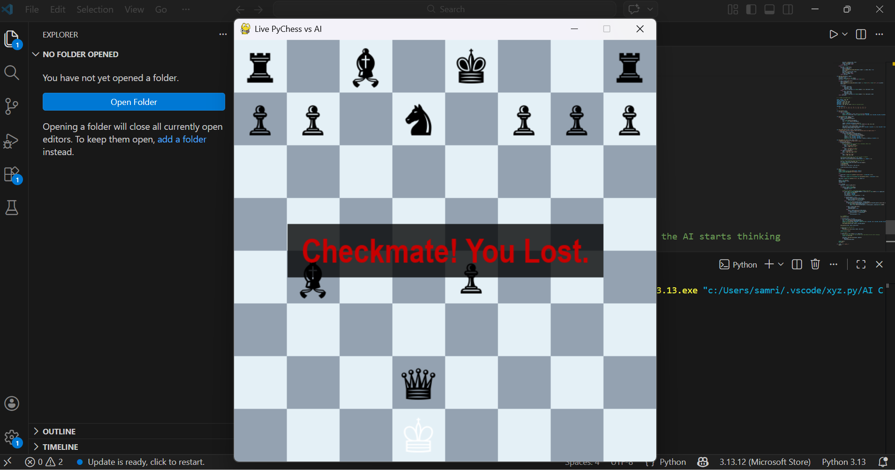

# Chess Game
## Technologies used:
Python with pygame module

## Project Description:
This is a Chess game built using python with pygame module for GUI. It has 2 playing mode either you can play against another human player or against AI. The AI was implemented using Minimax algorithm with alpha beta pruning and with the depth search of 3.

Inorder to model a chessboard within a data structure a 2D array was used with the dimensions of 8x8. The chessboard array could store 64 gametiles objects and each gametile object stored a tile number and a chess piece object.

## Files Description:

1. **Board Directory**: 
      - Board.py: In this file we create a class of chessBoard and initialize and declare a 2D array of gametiles with null pieces and then place all the chess pieces on the board on their respective starting positions. 
      - move.py: In this file we define some of the special cases in chess for example castling, enpassant rule, check. functions are used to check whether the the player is in check, return moves available in case the player is in check, return moves in case of castling and return moves available in case of enpassant rule.
      - Tile.py: It creates a Tile class which is placed on chessboard array. It can store a position number on the board and a chess piece object. 

2. **chess Art directory**: Contains all the images of the chess pieces.

3. **pieces directory**: Contains files in which every chess piece class is defined. Every chess piece class has alliance (indicating whether the piece is white or black) and position ( coordinates on the chessboard ) attributes. It also has legalmove method which is used to calculate the legal moves for that chess piece on the chessboard. 

4. **Player directory**:
      - AI.py: Contains the logic for AI algorithm. The AI was implemented using recursive Minimax algorithm with alpha beta pruning and with the depth search of 3. The evaluation function assigned each chess piece a value, White pieces were assigned a positive value based on their rank and black pieces were assigned negative value based on their rank as well. So the total value becomes 0 in the start of the game where each side has all the pieces. The algorithm tried to search all possible moves up to the depth of 3 and calculate which next move could allow it to have best evaluation value.

5.  **Playchess.py**: Main file of the program which merges all the functionality from the other files and itself as well to implement all this on pygame GUI.
      
5. **Screen**:
Game Screen

    1. Main Screen: 
     )  
    2. Starting position:
      
    3. The GUI guiding player which moves he can play after he clicked on his left white queen :
      
    4. Game End screen:
      

> **WARNING!!!**
>
> The board is rotating each turn by default! The active player always placed at the bottom!

## Built With

- [Telegraf.js](https://github.com/telegraf/telegraf) - Telegram bot framework for Node.js.
- [Node-Chess](https://github.com/brozeph/node-chess) - A simple node.js library for parsing and validating chess board position with an algebraic move parser.
- [Knex](https://github.com/tgriesser/knex) - A query builder for PostgreSQL, MySQL and SQLite3, designed to be flexible, portable, and fun to use.

## Improvements
The AI for the game could certainly be improved. An average chess player can easily beat the AI because the AI sometimes make a blunder move , the reason could be because of the evaluation function and the shallow depth of the possibilities explored by the algorithm. The evaluation function could be improved to also take into consideration the position of the chess pieces on the board along with value of the chess pieces. We can train a deep learning model and deploy it into the game if we have enough data.

## How to INSTALL and RUN

1.    

`git clone https://github.com/mrunknown555x7007-crypto/AI-Based-ChessBot.git`

`cd chess-game-AI-project`

`pip install pygame chess`

2.    In order to run the game. write the command on terminal or cmd.

`python3 playchess.py`

3.  TO RUN THE GAME BY EXICUTING PYTHON SCRIPT

    ` AI Chessbot.py`

    ## AUTHER : SAMRIDH MISHRA
